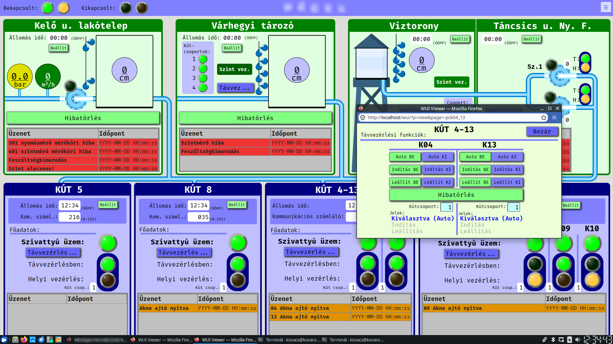

This project (WUI) is licensed under the MIT License. 

The WUI (**W**eb-based **U**ser **I**nterface) is a SCADA system used for the visualization, control and data collection of industrial processes. The system includes:

- the ability to create and graphically edit visualization/control page,
- running the pages with real-time data,
- configuring data collector clients,
- adding PLCs to data collectors,
- defining data areas in PLCs (PLC variables),
- importing and exporting every file that supports online editing,
- managing user groups and assigning permissions. See the LICENSE file for details.

<a href="https://kdr.hu/video/WUI%20SCADA%20rendszer%20bemutat%C3%B3.mp4" target="_blank">Video for an older version of WUI</a>

<a href="https://kdr.hu/video/WUI%20Trend.mp4" target="_blank">New trend function video</a>

See the [doc/wui_doc_en.md](doc/wui_doc_en.md) for the documentation.
