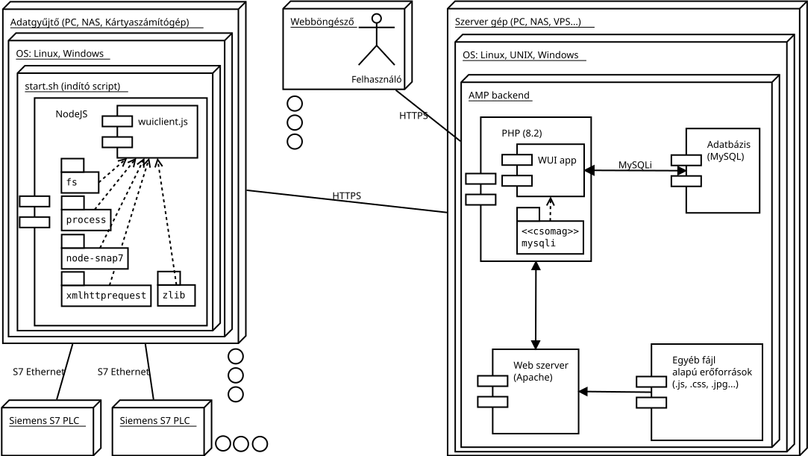
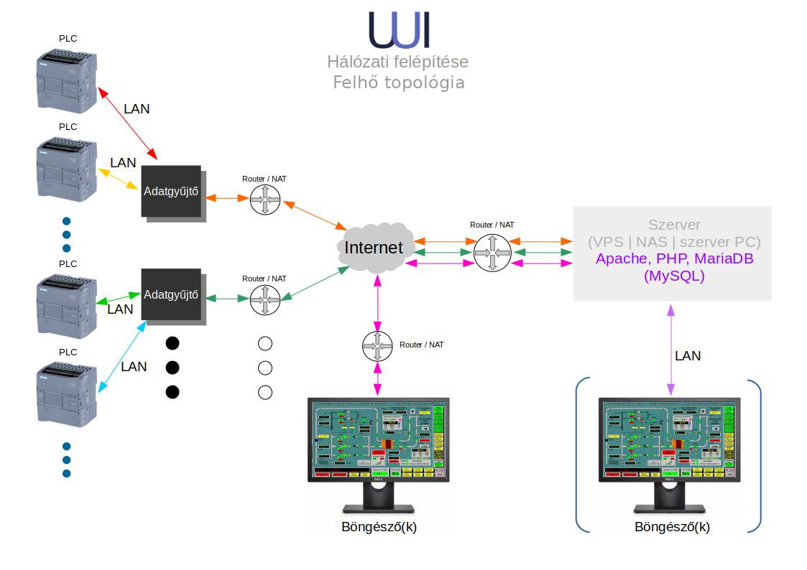
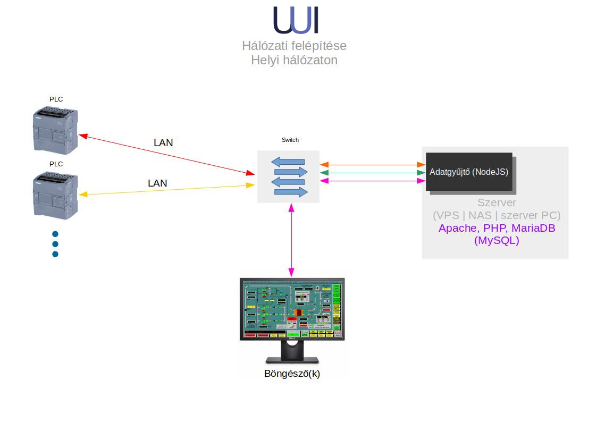
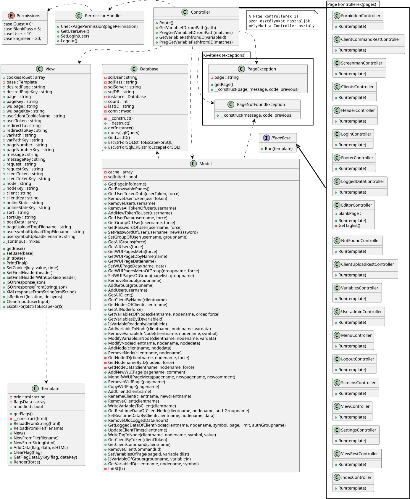
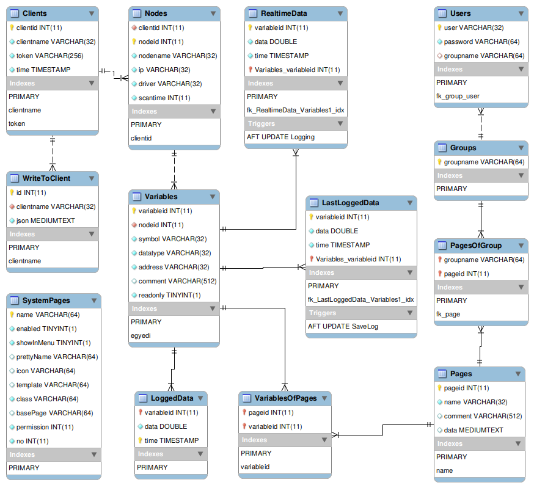
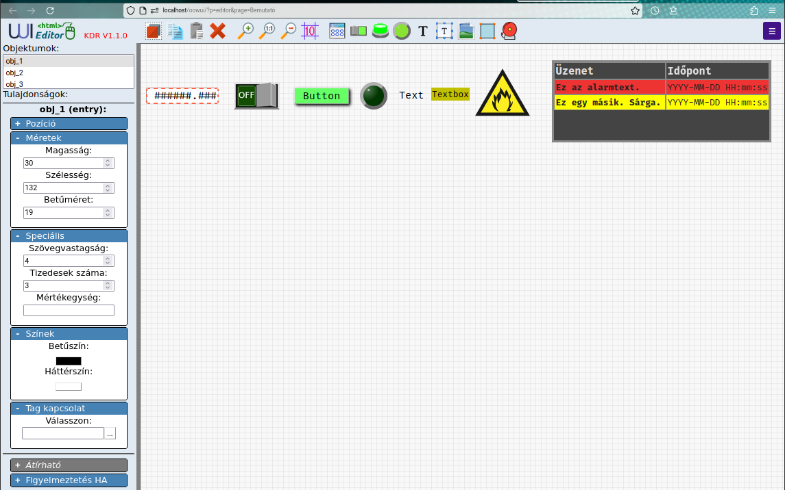
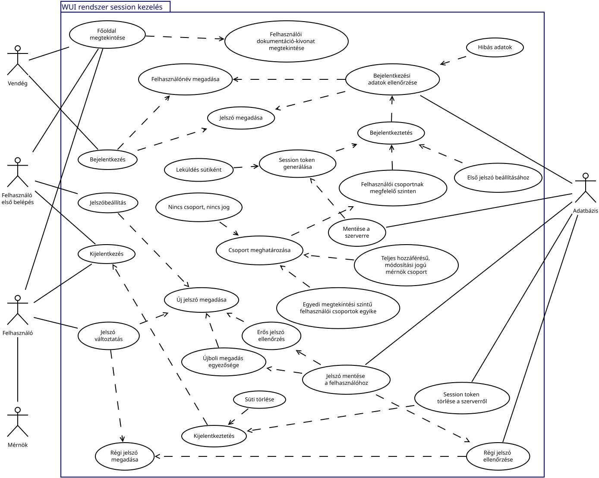
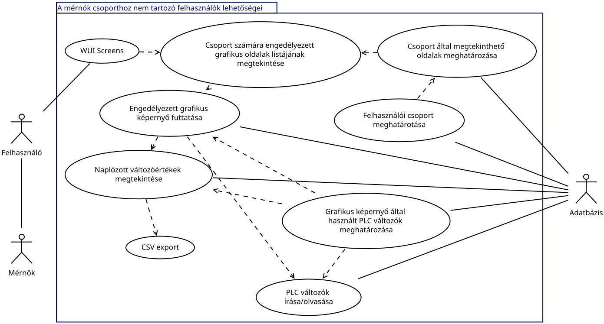
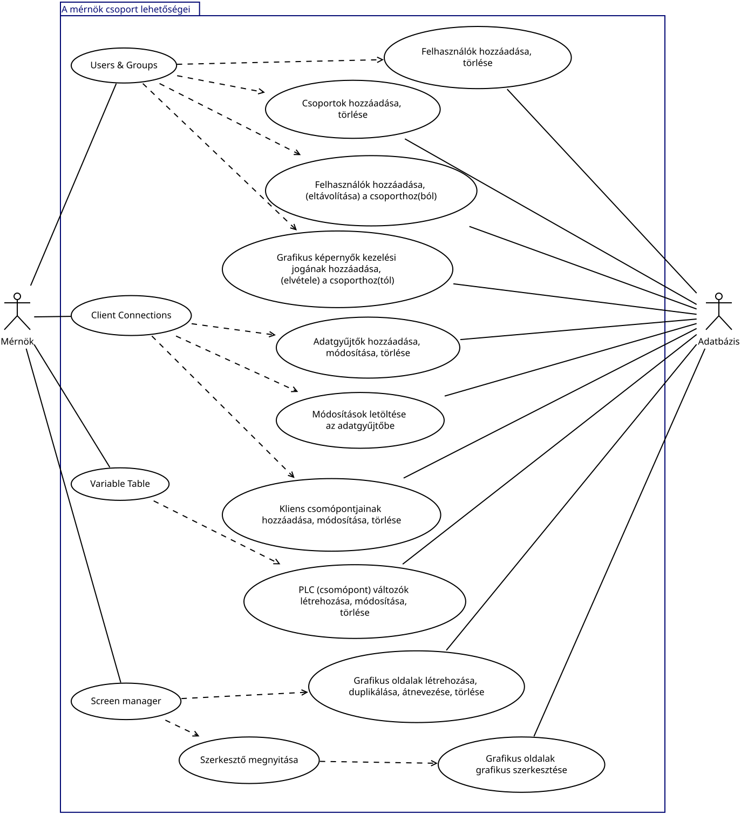
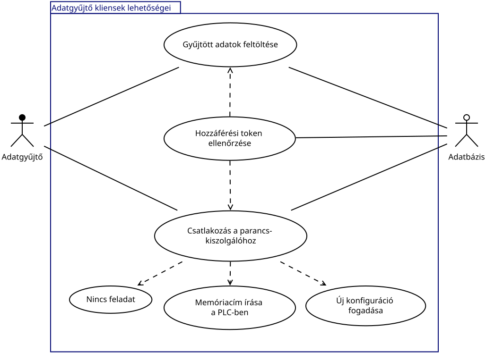

WUI Program Documentation
=========================

(AI translated)

|Author:            |[Kovács Dávid Róbert](https://kdr.hu/cv) |
|:----------------- |----------------------------------------:|
|Educational ID:    |                              72656388053|

#### [Project directory](https://server.kdr.hu/cloud/browse.php?dir=Nyilv%C3%A1nos/oowui/)

### Table of Contents

|Chapter |Page|
|:----|----:|
|1) Introduction|2|
|1.1) System overview|2|
|1.2) Overview of program units|3|
|2) Architecture|4|
|2.1) Installation options|4|
|2.1.1) Installation on a web server|4|
|2.1.2) Alternative installation on a NAS server|6|
|2.2) Overview of PHP classes|7|
|2.2.1) Simplified class diagram|7|
|2.2.2) Instantiable classes|8|
|2.2.3) Abstract classes|8|
|2.3) Database|14|
|2.3.1) Table schema|14|
|2.4) More important client-side JavaScript functions|22|
|2.5) Data collector client|25|
|3) Use cases|26|
|3.1) Login, session management|26|
|3.2) General system user capabilities|27|
|3.3) Capabilities of members of the Engineer group|28|
|3.4) Capabilities of data collector clients|29|
|4) Further development and optimization opportunities|30|
|5) Acknowledgements|32|

1) Introduction
---------------
### 1.1) System overview
The WUI (**W**eb-based **U**ser **I**nterface) is a SCADA system used for the visualization, control and data collection of industrial processes. The system includes:

- the ability to create and graphically edit visualization/control pages<sup>1</sup>,
- running the pages with real-time data,
- configuring data collector clients,
- adding PLCs to data collectors,
- defining data areas in PLCs (PLC variables),
- importing and exporting every file that supports online editing,
- managing user groups and assigning permissions.

>1: etymological explanation: see *2.2.3/CONTROLLER/PageController classes/EditorController*

[Short introductory video (00:03:56)](https://kdr.hu/video/WUI%20SCADA%20rendszer%20bemutat%C3%B3.mp4)

---

### 1.2) Overview of program units
Technically, the system consists of three clearly separated program units:

1. Server-side program component (PHP)
    - users,
    - sessions,
    - permission management,
    - database communication,
    - servicing data collectors,
    - other backend-related tasks.
2. Data collector unit (NodeJS)
    - maintaining connections with the
        - server *and*
        - PLCs connected to it,
    - collecting and writing data using the communication protocol of the given PLC type,
        - currently implemented: **Siemens S7 Protocol**,
        - *planned extension: __Modbus TCP__*,
    - receiving PLC descriptor data and write commands "from the server" and processing them,
    - handling communication and other errors.
3. Client-side user interfaces (JavaScript)
    - the more complex client-side (browser-based) editing and data-display tasks belong to this part:
        - HTML5 WYSIWYG editor – "runtime" editor,
        - running the edited page and populating it with data,
        - CRUD management of PLC variables,
        - import/export facilities for the above components.


2) Architecture
---------------

### 2.1) Installation options
#### 2.1.1) Installation on a web server



The web component of the system runs on a simple AMP server.  
Required PHP version: *PHP/8.2.12.* Either *MySQL* or *MariaDB* is suitable as the database management system. The database systems used for testing were:

- *10.4.32-MariaDB* and
- *10.11.11-MariaDB*.

The web server type is: *Apache/2.4.58 (Unix)*.  
PHP uses the *MySQLi* class to access the database. The system does not use external PHP libraries. Regular administrative tasks are triggered by requests arriving at the server; the current version does not use scheduled tasks (e.g. cron).

Users can access the system functions through a web browser.

>For the "engineer" group these may include system administration and editing functions; other users are provided only with viewing and control capabilities on the subsystems permitted for their group.

Tested browsers:

- *Google Chrome 134.0.6998.88*
- *Firefox 136.0.1*.

The appearance and handling may differ between the two browsers, but the functionality and the aesthetics of the intended graphical structure are ensured in both cases.  
The system does not use a web API that strictly requires a secure (HTTP**S**) connection, but since even downloading a file can trigger a warning when SSL is not used, it is advisable to choose this connection method. Automatic redirection can already be configured on the web server, providing both usability and security benefits.

Besides system users, the data collector clients also connect to the server. They communicate with the server through REST APIs. They upload data collected from PLCs at a predefined frequency and execute tasks sent by the server in real time. Running the data collector program requires a *NodeJS* environment on the data collector devices, and the modules shown in the diagram must be imported and installed. The NodeJS version used during testing was *v18.17.1*.  
The data collectors can read and write data from PLCs accessible on their local network (or through a *VPN*). Currently, only the *S7 Ethernet* protocol provided by the ***node snap7*** package is supported, allowing communication with most Siemens PLCs.


Here is a more marketing-friendly version of the UML diagram above:  
#### 

The installation plan described above can be augmented with virtual networks; the server machine can itself be the computer running the browser, but it can also operate as a cloud service. Of the many possible combinations, one more is discussed in greater detail:

---

#### 2.1.2) Alternative installation on a NAS server

End users may require the entire SCADA system to operate on their local OT network, with the user interface accessible only from the local network on dedicated computers. The primary reason for this may be information security, but it is also relevant that they may not want to pay recurring additional costs for maintaining an external IT infrastructure. Many users would prefer to receive a "boxed product" for the tasks to be performed. Some NAS servers (e.g. Synology) already provide all the functionality required for an AMP server, and the NodeJS runtime can also be installed on them. An additional advantage over a local server PC is that with a NAS, the IT/OT war front lines can be pushed further back (operating-system update requirements, the Win10–11 transition issue, etc.). A NAS server has its own operating system, and firmware updates should only be necessary in exceptional cases (for example, in the event of a glaring security vulnerability). The following diagram shows this installation method:

#### 

---

### 2.2) Overview of PHP classes
#### 2.2.1) Simplified class diagram


The diagram above shows a simplified class diagram of the PHP program running on the server side. The simplification consists of reducing the number of relationships in order to preserve clarity. The program implements an object-oriented MVC structure. The double-thick line indicates that the controllers of the individual pages have access to the same classes as the *Controller* class itself.

#### 2.2.2) Instantiable classes
Most classes are abstract; the instantiable classes are the following:

- **Template** class  
This implements template management. It can create an instance from text or a file and can recursively replace special keywords with either text or another template.
- **PageException** and **PageNotFoundException** classes  
These are part of error handling and derive from the **Exception** class. Their purpose is to assign specific errors to their own types so that they can be handled as groups.
- **Database** class  
This class follows a *singleton* design because the system communicates with only *one* database server. Besides establishing the connection, its tasks include:
    - sanitizing queries containing user-provided data and handling *SQL injection* in a programmer-friendly way,
    - recording the number of the returned last *ID*,
    - counting queries (for optimization),
    - releasing resources.

#### 2.2.3) Abstract classes
The remaining (abstract) classes are discussed below according to the MVC structure:

- **VIEW** unit:
    - **View** class  
      This class performs the bulk of the display and user-interaction functions.
        - determining/handling the request method and type,
        - handling HTML headers,
        - handling cookies,
        - sanitizing incoming data,
        - encoding the output format as JSON when necessary,
        - assembling the output HTML from templates,
        - only this class writes to the output buffer.
    - **Template** class  
      see above: ***2.2.2/Template class***.
- **CONTROLLER** unit:
    - **Controller** class
        - runs the requested Page controller (the server for the opened web page), if possible, taking user permissions into account,
        - loads the template required by the given page, if there is one,
        - determines the icon and other required data belonging to the page.
    - **PermissionHandler** class
        - determines the permissions of the logged-in user and manages the session,
        - contains functions that help Page controllers adapt the page to the user's permission level.
        - User levels are defined by the ***Permissions*** *enum*:
            - 0: Guest
            - 5: BlankPass
            - 10: User
            - 20: Engineer
    - **PageController** classes  
      These all participate in serving the given (visited) page or a part of it. They do not necessarily produce a document body. Their common property is that they implement the ***IPageBase*** interface, which requires the class to define the ***Run(****Template****)*** method. This method executes the body of the Page controller class and thereby provides the class with its associated template.
        - **ForbiddenController**  
        Redirect target when a forbidden resource is requested.
        - **ClientCommandRestController**  
        A REST controller that maintains communication with the data collectors. After a client request, it waits for up to 20 seconds with an empty response. If data addressed to the client appears in the database in the meantime, the information is sent immediately. The client is responsible for issuing another request to the resource immediately after receiving either an empty response or a response containing a command (in an infinite loop). This class is primarily responsible for ensuring that PLC variable writes initiated by users are executed in real time, in a near-deterministic manner.
        - **ScreenmanController**  
        With Engineer access, this page lists the graphical screens created so far and provides facilities for managing them. New graphical pages can also be added here.
        - **ClientsController**  
        With Engineer access, this page provides management facilities for data collector clients and their associated nodes (PLCs).
        - **HeaderController**  
        Generates the dynamic header for pages that require it.
        - **LoginController**  
        Provides the login facility. If the user is not logged in, only this and the main page are accessible.
        - **FooterController**  
        Generates the dynamic footer for pages that require it.
        - **LoggedDataController**  
        Displays logged variable values and provides the possibility to export them in *CSV* format.
        - **ClientUploadRestController**  
        A REST controller that communicates with data collectors. At configured intervals, the data collector uploads the values of the requested PLC variables here. The data arrives in *JSON* format with *gZip* compression. Decompression and conversion into an associative array are performed by the ***View*** class.
        - **VariablesController**  
        Users with Engineer access can define and manage variables for previously added nodes (PLCs) on the page generated by this class. A significant part of the functionality is not handled by this class, but by the js/***variables.js*** JavaScript file.
        - **UseradminController**  
        Users with Engineer access can add users on the page generated by this class and define their permissions there.
        - **MenuController**  
        Like the *Header-* and *FooterController*, this generates only one part of the page: the drop-down hamburger menu. Its contents are influenced by functions defined in the *PermissionController*, according to the user's level.
        - **EditorController**  
        This class also serves only Engineer-level users. The web page generated by the class allows graphical screens to be edited in *WYSIWYG* mode.  
The saving of graphical screens is also performed by this class. Before saving, it analyzes the page: it determines which *PLC variables* are used by the graphical page being uploaded and separately saves their IDs (primary keys). This will later be important for information-security reasons. A significant part of the functionality is again provided not by this class but by the js/***editor.js*** JavaScript file.
>**Here I have to come clean:** Different HMI editor environments call these graphical pages *Display* or *Screen*, and collectively they are usually called the *Runtime*. I have used these terms rather liberally in the project, including their Hungarian translations. If that were not enough, I also added *page*, *Page* and *WUIPage*. I can promise that in the **documentation**, the online-edited page created for displaying live data will consistently be called a "**graphical page**" or "**graphical screen**", so that it is harder to confuse it with the web pages that form part of the system.
        - **LogoutController**  
        Has no response body; it only logs the user out and redirects to the main page.
        - **ScreensController**  
        For logged-in users, this class generates the list of graphical pages they are allowed to view. The links to the graphical pages point to the following controller:
        - **ViewController**  
        The main task of this class is to return the *HTML* code of the graphical page requested by the user and load the js/***view.js*** JavaScript file if the user is allowed to view that graphical page. See also: ***ViewRestController***.
        - **SettingsController**  
        Handles users' personal settings. Currently it is used only for changing the password.  
Its additional function is that newly created users can set their initial password here. (The password of newly created users is empty.) Until the logged-in user has set a password, they can access only this class's page, the main page and logout. They have no permission for other pages/functions.
        - **ViewRestController**  
        The js/***view.js*** JavaScript code discussed above sends API queries to this class. At a configurable frequency it reads the live data displayed on the graphical page, and performs an immediate request in response to interaction (in which the write request is sent). This class provides the service.
        - **NotFoundController**  
        The server for the good old 404 page. The ***Controller*** class redirects the browser here when it requests a non-existent page. Which page "exists" and which does not is discussed in the database section, under the "SystemPages" table.
        - **IndexController**  
        Last but not least: this is the class belonging to the main page. It loads the main page, which displays a "teaser" section of the user documentation from a template.
- **MODEL** unit:
    - **Model** class  
    This is the largest class, and apart from the ***Database*** (***2.2.2/Database***) class it is the only class belonging to the MODEL unit. Its task is, naturally, to manage and preprocess stored data. It also implements caching. All data is stored in the *relational database server*. When designing *SQL queries*, I aimed to have the database server perform the majority of the information processing. Further processing is performed by the functions/methods of the **Model** class, and if any processing tasks remain, the *Page controllers* perform them.  
The functions (and methods) can be grouped according to their purpose as follows:
        - **basic functions of the web PHP framework**
            - GetPageInfo(*name*)
            - GetBrowsablePages( )
            - InitSQL( )
        - **user and session management**
            - GetUserTokenData(*userToken, force*)
            - RemoveUserToken(*userToken*)
            - RemoveUser(*username*)
            - RemoveAllTokenOfUser(*username*)
            - AddNewTokenToUser(*username*)
            - GetUserData(*username, force*)
            - GetGroupOfUser(*username, force*)
            - GetPasswordOfUser(*username, force*)
            - SetPasswordOfUser(*username, newPassword*)
            - SetGroupOfUser(*username, groupname*)
            - GetAllGroups(*force*)
            - GetAllUsers(*force*)
            - RemoveGroup(*groupname*)
            - AddGroup(*groupname*)
            - AddUser(*username*)
        - **graphical screen administration**
            - GetWUIPagesMeta(*force*)
            - GetWUIPageIDbyName(*name*)
            - GetWUIPageData(*name*)
            - SetWUIPageData(*name, data*)
            - GetWUIPagesMetaOfGroup(*groupname, force*)
            - SetWUIPagesOfGroup(*pagelist, groupname*)
            - AddNewWUIPage(*pagename, comment*)
            - MondifyWUIPageMeta(*pagename, newpagename, newcomment*)
            - RemoveWUIPage(*pagename*)
            - CopyWUIPage(*pagename*)
        - **data collector and node administration**
            - GetAllClient( )
            - GetClientByName(*clientname*)
            - GetNodesOfClient(*clientname*)
            - GetAllNode(*force*)
            - ModifyNode(*clientname, nodename, nodedata*)
            - AddNode(*clientname, nodedata*)
            - RemoveNode(*clientname, nodename*)
            - GetNodeID(*clientname, nodename, force*)
            - GetNodenameByID(*nodeid, force*)
            - GetNodeData(*clientname, nodename, force*)
            - AddClient(*clientname*)
            - RenameClient(*clientname, newclientname*)
            - RemoveClient(*clientname*)
        - **management of variables belonging to nodes**
            - GetVariablesOfNode(*clientname, nodename, order, force*)
            - GetVariablesByID(*variableid*)
            - IsVariableReadonly(*variableid*)
            - AddVariableToNode(*clientname, nodename, vardata*)
            - RemoveVariableInNode(*clientname, nodename, symbol*)
            - ModifyVariableInNode(*clientname, nodename, vardata*)
            - SetVariablesOfPage(*pageid, variableidlist*)
            - IsVariableOfGroup(*groupname, variableid*)
            - GetVariableID(*clientname, nodename, symbol*)
        - **live variable data management + data logging**
            - WriteVariablesToClient(*clientname*)
            - GetRealtimeDataOfClientNode(*clientname, nodename, authGroupname*)
            - SetRealtimeDataByClient(*clientname, nodename, data*)
            - RemoveOldLoggedData(*hours*)
            - GetLoggedDataOfClientNode(*clientname, nodename, symbol, page, limit, authGroupname*)
            - WriteTagInNode(*clientname, nodename, symbol, value*)
        - **data collector authentication**
            - GetClientByToken(*clientToken*)
            - GetClientCommand(*clientname*)
            - RemoveClientCommand(*id*)
            - UpdateClientTime(*clientname*)

---

### 2.3) Database

#### 2.3.1) Table schema:



The database consists of 14 tables. The tables use utf8mb4_general_ci collation. I used two types of storage engines:

- **InnoDB** engine  
I used this engine for general-purpose tables. It provides most of the required functionality.
- **MEMORY** engine  
Because of its high speed and storage method, I used this engine for tables where the number and frequency of overwrite operations are relatively high, but the stored values lose their informational value after a few seconds.

#### Table names and their storage engines:

|No.|Name              |Engine |
|:--|-----------------|------|
|1  | Clients         |InnoDB|
|2  | Groups          |InnoDB|
|3  | LastLoggedData  |MEMORY|
|4  | LoggedData      |InnoDB|
|5  | Nodes           |InnoDB|
|6  | Pages           |InnoDB|
|7  | PagesOfGroup    |InnoDB|
|8  | RealtimeData    |MEMORY|
|9  | SystemPages     |InnoDB|
|10 | UserTokens      |InnoDB|
|11 | Users           |InnoDB|
|12 | Variables       |InnoDB|
|13 | VariablesOfPages|InnoDB|
|14 | WriteToClient   |InnoDB|

#### 2.3.2) Table structure and purpose

I mark the primary key with **P**, the unique column with **U**, and foreign keys with **F**. Groups are marked with **[ ]** brackets.

#### Clients:

|Property| Column       | Type      |Null| Default           |Extra         |
|:---------:|--------------|------------|-----|-------------------|--------------|
|P          |***clientid***|int(11)     |No   |                   |AUTO_INCREMENT|
|U          |**clientname**|varchar(32) |No   |                   |              |
|U          |**token**     |varchar(256)|No   |                   |              |
|           |time          |timestamp   |No   |current_timestamp()|              |

The table containing the data of data collector clients. The access token is also stored here. The system generates it when a new client is added. The token must be copied into the client's configuration file. The user sees only the client name, which can also be changed, because the system identifies the client by its ID number.

#### Nodes:

|Property|Column          |Type                      |Null |Default|Extra         |
|:---------:|----------------|---------------------------|------|---------------|--------------|
|F          |**clientid**    |int(11)                    |No   |               |              |
|P          |***nodeid***    |int(11)                    |No   |               |AUTO_INCREMENT|
|U          |**nodename**    |varchar(32)                |No   |               |              |
|           |ip              |varchar(32)                |No   |               |              |
|           |driver          |varchar(32)                |No   |               |              |
|           |scantime        |int(11)                    |No   |1000           |              |

The table of PLCs connected to data collectors. It references the client above it, and is identified in the same way as the client. The refresh time for the given PLC can be configured here. Every variable in the given PLC will be read at this frequency. If its name, IP address or refresh time is modified, the new configuration must be downloaded to the client (this is only one click if the server address and access token have been correctly configured in the client's configuration file).

#### Groups:

|Property|Column         |Type      |Null|Default|
|:---------:|---------------|-----------|-----|---------------|
|P          |***groupname***|varchar(64)|No  |               |

Contains the names of the user groups. During a fresh installation, make sure that the *"engineer"* group is present. A user can belong to one group. The group determines which graphical screen the user may view. Only members of the *engineer* group have editing privileges. They can view all pages. The group name cannot be modified, only deleted. Development opportunity: assign IDs to the groups so that their names can be changed.

#### Users:

|Property|Column     |Type      |Null   |Default |
|:---------:|-----------|-----------|--------|----------------|
|P          |***user*** |varchar(32)|No     |                |
|           |password   |varchar(64)|No     |                |
|F          |groupname  |varchar(64)|Yes    |NULL            |

The user table. During a fresh installation, make sure that the *"engineer"* user is present. The user's group and password are stored here, with the password encoded using **SHA256**. A newly added user does not yet have a group; in this case the value is *NULL*. No group, no permissions.

#### Variables:

|Property|Column          |Type         |Null|Default|Extra         |
|:---------:|----------------|--------------|-----|---------------|--------------|
|P          |***variableid***|int(11)       |No  |               |AUTO_INCREMENT|
|F          |**nodeid**      |int(11)       |No  |               |              |
|U          |**symbol**      |varchar(32)   |No  |               |              |
|           |datatype        |varchar(32)   |No  |               |              |
|           |address         |varchar(32)   |No  |               |              |
|           |comment         |varchar(512)  |Yes |NULL           |              |
|           |readonly        |tinyint(1)    |No  |0              |              |

The table of variables belonging to the nodes (PLCs). For users, the name identifies the variable, while the system uses the ID number (the advantages described above therefore apply to variables as well). Users can reference PLC variables exactly as follows: **clientName/nodeName/variableName**. The following data types have been implemented: *Bit, Int8, UInt8, Int16BE(S7), Int16LE, UInt16BE(S7), UInt16LE, Int32BE(S7), Int32LE, UInt32BE(S7), UInt32LE, FloatBE(S7), FloatLE*. Variable sizes greater than 32 bits are rare in automation, so I did not implement them.

#### RealtimeData:

|Property |Column           |Type     |Null |Default            |
|:----------:|-----------------|----------|------|-------------------|
|P           | ***variableid***|int(11)   |No   |                   |
|            |data             |double    |No   |                   |
|            |time             |timestamp |No   |current_timestamp()|

\*Trigger: Logging AFTER UPDATE

The system stores the variable values uploaded by the data collectors in this table. The data collector only knows the PLC address and data type of the variable from the *nodelist.json* file, which can also be modified remotely. The system identifies the variable based on the **Variables** table. If the user has redundantly defined variables, variables belonging to the same *node*, having the same address and data type, receive the same uploaded value. This can also be useful: one variable may be writable while another is *readonly*. The upload time is also important, because the *runtime* uses it to determine whether a variable has not been updated for a long time (for example, because some part of the connection has been interrupted). In this system this is 20 seconds. Within the system there are no different data types anymore: every type is stored as a *double*. Even 32-bit integer values are represented exactly.

>**This is very important**, because if, for example, we wanted to assign error messages to all 32 bits of an **INT32**, inaccurate representation could cause error messages to appear (or not appear) even though they are not real. The reliability of the error messages would therefore depend on whether their bits were closer to the *MSB* or had a lower place value. This is, of course, unacceptable.

The trigger is used to store the incoming data in the **LastLoggedData** table. I will describe this trigger in more detail at the **LastLoggedData** table.

#### LoggedData:

|Property|Column          |Type    |Null|Default            |
|:---------:|----------------|---------|-----|-------------------|
|[P F       |***variableid***|int(11)  |No  |                   |
|P]         |***time***      |timestamp|No  |current_timestamp()|
|           |data            |double   |No  |                   |

This table contains the logged variable data. The value of every variable is deleted after 168 hours.

#### LastLoggedData:

|Property |Column          |Type     |Null|Default            |Extra                        |
|:----------:|----------------|----------|-----|-------------------|-----------------------------|
|P F         |***variableid***|int(11)   |No  |                   |                             |
|            |***time***      |timestamp |No  |current_timestamp()|ON UPDATE CURRENT_TIMESTAMP()|
|            |data            |double    |No  |                   |                             |

\*Trigger: SaveLog AFTER UPDATE

The logged data is first stored here, and then the trigger copies it to the **LoggedData** table. Based on the trigger of the **Variables** table, variables are added to this table only if:

- the change compared to the previous value is greater than 10% **OR**
- the absolute value of the change is greater than or equal to 1 (because of INT values) **OR**
- more than 60 seconds have passed since the previous logging.

When there are tens of thousands or hundreds of thousands of records, this check can take several seconds, so it is useful to have a table containing only the previously saved value, especially if it is stored in memory. This is why the table is necessary.

#### Pages:

|Property |Column      |Type       |Null|Default|Extra         |
|:----------:|------------|------------|-----|---------------|--------------|
|P           |***pageid***|int(11)     |No  |               |AUTO_INCREMENT|
|U           |**name**    |varchar(32) |No  |               |              |
|            |comment     |varchar(512)|Yes |NULL           |              |
|            |data        |mediumtext  |Yes |NULL           |              |

The HTML code of the graphical screens is stored in this table. Proper *escaping* is important.

#### PagesOfGroup:

|Property |Column          |Type      |Null |Default|
|:----------:|----------------|-----------|------|---------------|
|[P F        | ***groupname***|varchar(64)|No   |               |
|P] F        | ***pageid***   |int(11)    |No   |               |

This table (junction table) records which graphical screens each group is allowed to view.

#### SystemPages

|Property |Column     |Type      |Null|Default|
|:----------:|-----------|-----------|-----|---------------|
|P           | ***name***|varchar(64)|No  |               |
|            | enabled    |tinyint(1) |No  |1              |
|            | showInMenu |tinyint(1) |No  |1              |
|            | prettyName |varchar(64)|Yes |NULL           |
|            | icon       |varchar(64)|Yes |NULL           |
|            | template   |varchar(64)|Yes |NULL           |
|            | class      |varchar(64)|No  |               |
|            | basePage   |varchar(64)|Yes |NULL           |
|            | permission |int(11)    |No  |               |
|            | no         |int(11)    |No  |               |

The table of the system's web pages. Based on this, the **Controller** class determines:

- whether the page is enabled,
- whether it may appear in the menu,
- what the page title and menu name will be,
- which icon is displayed in the menu,
- whether it has a template and, if so, which one,
- the class name of the server-side Page controller,
- whether it has a root template (***basePage***) and, if so, which one,
- at which user level the page can be viewed,
- its order in the menu.

If the *GET* variable **p** contains a name that does not occur in the ***name*** column, the page does not exist and a redirect to the 404 page takes place. If both ***template*** and ***basePage*** are *NULL*, the system does not need to return *HTML*. These include REST services and the logout page (which only performs the logout and redirects).

#### UserTokens

|Property|Column    |Type      |Null|Default            |Extra         |
|-----------|----------|-----------|-----|-------------------|------------- |
|P          | ***id*** |int(11)    |No  |                   |AUTO_INCREMENT|
|F          | user     |varchar(32)|No  |                   |              |
|U          | **token**|varchar(36)|No  |uuid()             |              |
|           | time     |timestamp  |No  |current_timestamp()|              |
|           | lastvisit|timestamp  |No  |current_timestamp()|              |

This table records the sessions. The user must have a valid **token** cookie in order to be logged into the system.

#### VariablesOfPages:

|Property|Column          |Type  |Null |Default|
|-----------|----------------|-------|------|---------------|
|[P F       |***pageid***    |int(11)|No   |               |
|P] F       |***variableid***|int(11)|No   |               |

When graphical screens are saved, the IDs of the variables used by the graphical page are stored in this junction table. Users who do not belong to the engineer group can access only those variables that belong to graphical pages which their group is allowed to view. Therefore, if someone tries to gain unauthorized access to data by studying the asynchronous requests, it will not work.

#### WriteToClient

|Property|Column    |Type       |Null|Default|Extra         |
|-----------|----------|------------|-----|---------------|--------------|
|P          |***id***  |int(11)     |No  |               |AUTO_INCREMENT|
|F          |clientname|varchar(32) |No  |               |              |
|           |json      |mediumtext  |No  |               |              |

On the web page used to manage the data collectors (**ClientsController**), the system inserts the data to be "downloaded" to the client into this table in *JSON* format. These records contain PLC data and variables. When a variable value is written on a graphical page, the write command is also placed here. The **ClientCommandRestController** instance to which a particular data collector is connected reads this table every 200 ms. If a record intended for the data collector appears in the table, its data is immediately sent to the client, and the record is deleted from the database. The client executes the command and then reconnects... Under idle conditions, it is sufficient to establish the *HTTP* connection every 20 seconds. This is how the system implements fast server → client data communication. Its only advantage over a WebSocket or MQTT server-based (...) solution is that it works on any hosting server.

---

### 2.4) More important client-side JavaScript functions

As I already mentioned in the ***PageController*** section above, there are several pages whose functionality is largely provided by client-side **JS** code. Instead of listing every function found in the **JS** files, I will describe what tasks the code performs.

- **editor.js**  
Its purpose is to provide a graphical development environment for editing graphical screens. The graphical screen objects are located inside the `<div id="editor"></div>` container. For saving and subsequent loading, the *outerHTML* of this element is stored instead of its *innerHTML*. This is necessary because the background color is stored in the *style* attribute of the *div* element. This also makes it possible to save common properties later. The graphical objects are predefined:
    - entry
    - switch
    - button
    - lamp
    - text
    - textbox
    - picture
    - square
    - alarmwindow
    - alarmtext.  
  
The figure above shows the graphical objects in question in the specified order.
    - Other important tasks:
        - creating objects
        - automatic numbering
        - modifying the properties of existing objects (object-specific)
        - modifying dynamic properties (PLC variable connection **/tag connection/**, expression handling, negation, min-max, warning levels, enabling blinking...)
        - searching for and selecting PLC variables (using an asynchronous query)
        - selecting an object by clicking it
        - selecting multiple objects in two ways
        - moving selected object(s) by moving the mouse
        - moving objects using the cursor keys
        - snapping to the grid (if enabled)
        - copying selected object(s) for the editor or to the system clipboard (converting them into a custom *JSON* format)
        - pasting (in both cases)
        - zoom handling
        - saving to the server
        - exporting
        - importing

- **variable.js**  
Adding PLC variables to nodes, deleting them and modifying them would not, by itself, require extensive **JS** code. Practical use, however, made it necessary for the browser to perform the following functions:
    - adding, deleting and modifying multiple variables without saving
    - automatic numbering of variable names
    - automatic incrementing of S7 PLC addresses while taking the data type size into account  
(M0.7 &rarr; M1.0; MD10 &rarr; MD14; DB2.DBW6 &rarr; DB2.DBW8...)
    - inheriting the previous property for the newly created variable (e.g. readonly)
    - filtering out conflicting variable names (symbol names)
    - recording the type of unsaved changes for later **SQL** operations (*DELETE, INSERT, UPDATE*)
    - handling variables that were created and then deleted without saving
    - saving a variable that was deleted without saving and then recreated with the same name
    - exporting (*CSV*)
    - importing

- **view.js**  
In a certain sense, this is the fruit of all the work described so far. Its tasks are:
    - scanning the `<div id="editor">...</div>` container and searching for objects having a *tag* connection
    - organizing the required *tags* (PLC variables) by data collector and node
    - scheduling and executing *tag* list queries at a configurable frequency
    - handling query redundancy
    - processing the returned data: making the connected objects dynamic
        - color
        - showing/hiding (also for warning texts)
        - updating values in *entry* elements
        - alarm-level animation
        - audible alarm
    - sending asynchronous requests to the server when writing input fields, switches and buttons
    - handling input-field limits
    - scheduling extra queries following a write request (so that the change becomes visible to the user as soon as possible)
    - handling communication errors
    - opening logged values in a new window
    - displaying logged messages (alarm text) (asynchronously querying the data log for the required variables and generating the messages from it: the time when the alarm became active and the time when it ceased), with the possibility of exporting them.

The JavaScript code was written directly in the *JS* language. *Development opportunity:* implement the code in **TypeScript**, using the appropriate interfaces and other language features.

---

### 2.5) Data collector client

Because the program is relatively small, I present the *NodeJS* program of the field data collector client using the following simplified function call tree:

```
start.sh
└── WHILE(1)
    └── wuiclient.js $@
        │
        ├── fs.readFile (configFile)
        │   ├── serverComm
        │   │   ├── XMLHttpRequest.onload
        │   │   │   ├── commander
        │   │   │   │   ├── fs.writeFile (nodelist.json)
        │   │   │   │   │    └── process.exit //new node.json
        │   │   │   │   ├── writeTagInNode
        │   │   │   │   │    └── writeTagInS7Node
        │   │   │   │   │        ├── s7getReadWriteMultiVarsElement
        │   │   │   │   │        └── Nodes[i].WriteArea
        │   │   │   │   └── console.log (unknown command)
        │   │   │   └── console.log (no new command)
        │   │   └── XMLHttpRequest.onerror
        │   │       └── serverComm (setTimeout)↺
        │   └── console.log (server URL, token)
        │
        ├── fs.readFile (nodelist.json)
        │   ├── newSnap7node (for loop)
        │   │   └── Nodes[i].ConnectTo
        │   │       ├── snap7reConnect //on communication error
        │   │       └── scanNodeMain
        │   │           └── s7scanNode
        │   │               └── setInterval ⥀
        │   │                   ├── Nodes[i].ReadMultiVars
        │   │                   ├── getValueFromBuffer
        │   │                   └── XMLHttpRequest (upload)
        │   └── console.log (nodeList loaded successfully)
        │
        └── process.exit //invalid configuration file
```

The program runs on two separate logical threads: one is responsible for processing commands received from the server (see ***2.3.2/WriteToClient*** table for a more detailed description), while the other collects data from the PLCs according to the description in *nodelist.json* and uploads it to the server.  
When a new *nodelist.json* arrives, the former thread saves it and exits the process. The startup *shell script* restarts the program, so the latter thread then works with the updated data.  
If a variable-write command arrives from the server, the first thread naturally does not restart the process, but executes the write.

The program structure is designed so that a new communication driver (e.g. **Modbus TCP**) can be implemented easily.


3) Use cases
------------

Although a few relevant pieces of information about the possible uses of the program system have already appeared in section **2)**, it is worth devoting a separate section to them. The following four *use case* diagrams present these possibilities.

### 3.1) Login, session management



The diagram above shows the cases of entering the system. At this level, three actors can ultimately be distinguished:

- Guest
- Newly added user (does not have a password yet)
- Logged-in user (at this point the user group is not relevant, hence the association between *Engineer* and *User*)

The fourth actor is the data collector client. Since it naturally does not use the interface intended for people, but communicates through a *REST API*, it is discussed in a separate diagram.

A *Guest* user may view only the main page and the login page. A newly added user with an empty password may access only the main page and the password-change page, and may also log out. Logged-in *users* with a valid password can change their password and access the main page and logout; naturally, they also have additional access, which can be seen in the next diagram.

### 3.2) General system user capabilities



Even in the diagram above, the additional permissions of the *Engineer group* are not shown; these appear in the third diagram.

Here we can see that the user can access the ***WUI Screens*** web page, where they can see the list of graphical pages permitted for their group. After selecting one, they can operate its graphical interface (read values, change setpoints, start a pump, etc.). More specifically, they can use the functions that the editor of the graphical page (a member of the Engineer group) has made available to them. If the page contains any PLC variable data, the user can also browse its logged values (going back 168 hours) and export them in *CSV* format. If a message window has been placed on the page, the user can read both current and logged values and can also export the logged messages.

>The **view.js** section already mentioned that error messages are not actually stored. It would be a waste: since every relevant change of every variable is logged, and the equation required to display the message is also available to the runtime, along with the message text and its color, the **JS** script can reconstruct the historical states of the messages retrospectively from these data. The result is a complete error (warning/message) log.

---

### 3.3) Capabilities of members of the Engineer group



The figure above shows that the *Engineer* group has access to all possible system-administration functions, including user management and design tasks. It is not indicated in the figure, but the **engineer** user has one advantage over members of the **engineer group**: their permissions cannot be revoked and they cannot be deleted. (And although this is already largely a matter of taste and may open a debate between the various camps of drinkers and abstainers, they also receive a "mug of beer" icon in the header.)

---

### 3.4) Capabilities of data collector clients



The two use cases above were discussed in detail under the ***2.2.3/CONTROLLER/ClientCommandRestController*** class and in the description of the ***2.3.2/WriteToClient*** database table. The data collector client has these capabilities. The access token is sent by the data collector to the server using the *GET* method on every access attempt.


4) Further development and optimization opportunities
------------------------------------------------------

The documentation has mentioned in several places which parts of the program could be extended with which functions and what could be implemented better or more optimally. The following list summarizes and expands on these ideas, without claiming completeness:

- Rewrite all code written in **JavaScript** in **TypeScript**, making use of all its possibilities.
- The **Model** class should be split into several logical units because its size makes it difficult to read.
- Every configuration value that is required during installation or modification of the system should consistently be moved into the global **$cfg** hash. Currently the **View** and **Database** classes contain many static variables for storing these values.
- In addition to the *names* of users and user groups, create their **IDs**, and use these as primary keys so that the names can be changed, as is already possible for clients, nodes and variables.
- Extend the permission levels so that individual groups can be granted editing rights for the desired graphical screens, while viewing rights can also be defined selectively. Currently, *only* the **Engineer** group can edit, it can edit *all* graphical pages, and it can view all of them. This would allow *one* system to serve multiple customers, including full administrative control over their own subsystems.
- Currently **PLC** (node) variable logging is automatic: there is no configuration option, and every variable that occurs on any graphical page is logged for 168 hours. The logging period and exceptional-logging logic are also identical for every such variable. Logging groups should be created to which any variable can be assigned, with the logging interval and logic configurable per group.
- Handling of error messages and alarm levels should be moved to the *backend*. This would allow the system to send warning emails. In connection with this, alarm groups should be created (who should receive the messages). Currently these functions work only while the *runtime* is open.
- ~~In the graphical editor, when multiple objects are selected, common properties should be changeable as a group (e.g. font color). Currently this is possible only with a single selection; multiple selection can only be used for position changes and copying~~.
- Implement the previously mentioned **Modbus TCP** (the "workhorse" of industrial communication protocols). For this, only the data collector client program needs to be extended, and a new `<option>` needs to be added to the `<select>` used for choosing the **Driver** in *Client Connections*.
- Reconsider the graphical objects: currently an input field (***entry***) is an `<input type="text" />` element both in the editor and in the viewer, even though text is never actually entered into it (during live input a dialog box appears and the value is entered there; the entry only displays the value read back). Non-closing tags, for example, do not have `::before` and `::after` pseudo-elements, which is a disadvantage: this is also why the pop-up button used to display data logs had to be implemented with JavaScript instead of *CSS*.

5) Acknowledgements
-------------------

I would like to thank my current workplace for providing inspiration for the project. Over the past 10 years I have become familiar with many industrial systems and have encountered the development and user expectations associated with visualization systems used in various industries.
I enjoyed every hour spent developing the program system. It was instructive to find my own solutions to problems that may also have caused a few sleepless nights for the developers of the systems I have used.

The distance between web development and manufacturing is becoming smaller nowadays. I would like to believe that this project also contributes, even if only slightly, to breaking down these boundaries.
